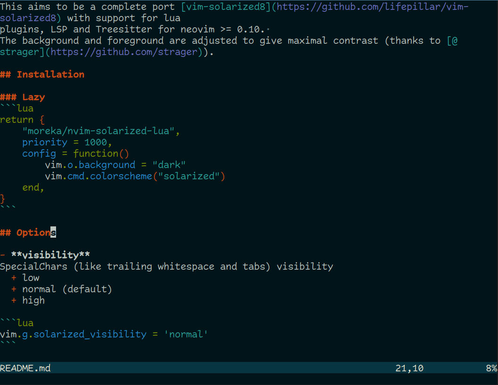

# Solarized Neovim

This aims to be a complete port [vim-solarized8](https://github.com/lifepillar/vim-solarized8) with support for lua
plugins, LSP and Treesitter for neovim >= 0.10. 
The background and foreground are adjusted to give maximal contrast (thanks to [@strager](https://github.com/strager)).

## Screenshots


## Installation

### Lazy
```lua
return {
    "moreka/nvim-solarized-lua",
    priority = 1000,
    config = function()
        vim.o.background = "dark"
        vim.cmd.colorscheme("solarized")
    end,
}
```

## Options

- **visibility**
SpecialChars (like trailing whitespace and tabs) visibility
  + low
  + normal (default)
  + high

```lua
vim.g.solarized_visibility = 'normal'
```

- **diffmode**
  + low
  + normal (default)
  + high
 
```lua
vim.g.solarized_diffmode = 'normal'
```

- **statusline**
  + low
  + flat
  + normal (default)

 ```lua
 vim.g.solarized_statusline = 'normal'
 ```

# NOTE
- Thanks to [@ishan9299](https://github.com/ishan9299) for the original port to lua (see [nvim-solarized-lua](https://github.com/ishan9299/nvim-solarized-lua)).
- Thanks for lifepillar's vim-solarized8 for providing most of the highlights and color codes for this scheme.
- If any more plugins are needed then open an issue.
